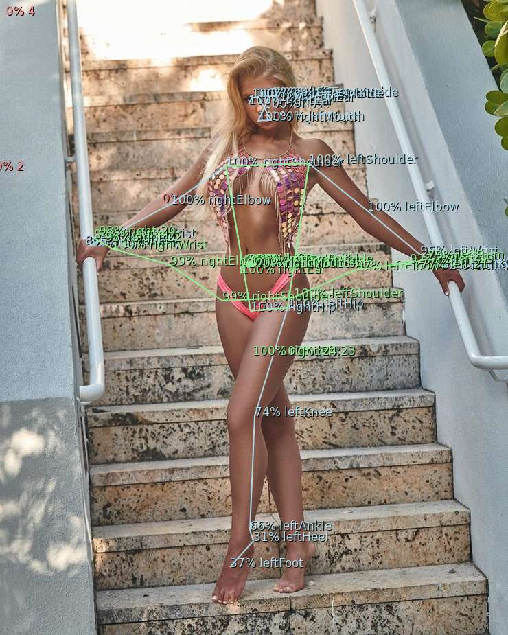

# BlazePose: Body Segmentation for TFJS and NodeJS

Included models:

- BlazePose Detector
- BlazePose Full Body Keypoints
- BlazePose Upper Body Keypoints

Models included in `/model/*` were converted to TFJS Graph model format from the original repository  
Models descriptors and signature have been additionally parsed for readability

<br>

## Implementation

Actual model parsing implementation in `/src/blazepose.js` does not follow original  
and is implemented using native TFJS ops and optimized for JavaScript execution

All models return object defined as:

- `keypoints`: array of keypoints where number of keypoints depends on the model used
  - `id`
  - `part`: annotated body part
  - `position`: x, y, z
  - `score`
- `visibleParts`: number of visible keypoints
- `visibileScore`: average score of visible keypoints
- `missingParts`: number of keypoints that were below threshold or not detected
- `avgScore`: overall average score

<br>

**Detector model** base implementation, but results are not processed as of yet

**Full body model** returns 39 keypoints

**Upper body model** returns 31 keypoints

For end-to-end demo, see `predict.js` that uses `/src/blazepose.js` for actual model execution and results processing

<br>

## Example



<br>

### Detector

```shell
# node signature.js model/blazepose-detect.json
```

```js
DATA:  inputs: [ { name: 'input:0', dtype: 'DT_FLOAT', shape: [ 1, 128, 128, 3 ] } ]
DATA:  outputs: [
  { id: 0, name: 'classificators:0', dytpe: 'DT_FLOAT', shape: [ 1, 896, 1 ] },
  { id: 1, name: 'regressors:0', dytpe: 'DT_FLOAT', shape: [ 1, 896, 12 ] },
]
```

### Full Body Keypoints

```shell
# node signature.js model/blazepose-full.json
```

```js
DATA:  inputs: [ { name: 'input_1:0', dtype: 'DT_FLOAT', shape: [ 1, 256, 256, 3 ] } ]
DATA:  outputs: [
  { id: 0, name: 'ld_3d:0', dytpe: 'DT_FLOAT', shape: [ 1, 195 ] },
  { id: 1, name: 'output_segmentation:0', dytpe: 'DT_FLOAT', shape: [ 1, 128, 128, 1 ] },
  { id: 2, name: 'output_poseflag:0', dytpe: 'DT_FLOAT', shape: [ 1, 1 ] },
]
```

### Upper Body Keypoints

```shell
# node signature.js model/blazepose-upper.json
```

```js
DATA:  inputs: [ { name: 'input_1:0', dtype: 'DT_FLOAT', shape: [ 1, 256, 256, 3 ] } ]
DATA:  outputs: [
  { id: 0, name: 'output_poseflag:0', dytpe: 'DT_FLOAT', shape: [ 1, 1 ] },
  { id: 1, name: 'output_segmentation:0', dytpe: 'DT_FLOAT', shape: [ 1, 128, 128, 1 ] },
  { id: 2, name: 'ld_3d:0', dytpe: 'DT_FLOAT', shape: [ 1, 155 ] },
]
```

## Test

```shell
# node predict.js inputs/model1.jpg
```

```js
2021-04-25 09:26:09 INFO:  TFJS tensors: 557 bytes: 30424704
2021-04-25 09:26:09 INFO:  Loaded image: inputs/model1.jpg inputShape: [ 1, 938, 638, 3, [length]: 4 ] decoded size: 1795332
2021-04-25 09:26:10 INFO:  Inference time: 294 ms
2021-04-25 09:26:10 DATA:  Results: [
  {
    name: 'detect',
    keypoints: [
      { id: 0, position: { x: 30, y: -24 } },
      { id: 1, position: { x: 235, y: 346 } },
      { id: 2, position: { x: 44, y: 308 } },
      { id: 3, position: { x: 26, y: -130 } },
      { id: 4, position: { x: 41, y: 36 } },
      { id: 5, position: { x: 27, y: -300 } },
    ]
  },
  {
    name: 'full',
    keypoints: [
      { id: 0, part: 'nose', position: { x: 312, y: 131, z: 0 }, score: 1 },
      { id: 1, part: 'leftEyeInside', position: { x: 314, y: 108, z: 0 }, score: 1 },
      { id: 2, part: 'leftEye', position: { x: 319, y: 105, z: -1 }, score: 1 },
      { id: 3, part: 'leftEyeOutside', position: { x: 325, y: 102, z: 0 }, score: 1 },
      { id: 4, part: 'rightEyeInside', position: { x: 299, y: 115, z: 0 }, score: 1 },
      { id: 5, part: 'rightEye', position: { x: 294, y: 118, z: 0 }, score: 1 },
      { id: 6, part: 'rightEyeOutside', position: { x: 288, y: 120, z: -1 }, score: 1 },
      { id: 7, part: 'leftEar', position: { x: 332, y: 105, z: 0 }, score: 1 },
      { id: 8, part: 'rightEar', position: { x: 283, y: 129, z: 0 }, score: 1 },
      { id: 9, part: 'leftMouth', position: { x: 325, y: 144, z: 0 }, score: 1 },
      { id: 10, part: 'rightMouth', position: { x: 305, y: 153, z: 0 }, score: 1 },
      { id: 11, part: 'leftShoulder', position: { x: 380, y: 199, z: -95 }, score: 1 },
      { id: 12, part: 'rightShoulder', position: { x: 258, y: 225, z: -121 }, score: 1 },
      { id: 13, part: 'leftElbow', position: { x: 414, y: 325, z: -65 }, score: 1 },
      { id: 14, part: 'rightElbow', position: { x: 208, y: 352, z: -124 }, score: 0.99 },
      { id: 15, part: 'leftWrist', position: { x: 381, y: 427, z: -105 }, score: 0.91 },
      { id: 16, part: 'rightWrist', position: { x: 254, y: 418, z: -149 }, score: 0.97 },
      { id: 17, part: 'leftPalm', position: { x: 376, y: 464, z: -118 }, score: 0.76 },
      { id: 18, part: 'rightPalm', position: { x: 270, y: 449, z: -156 }, score: 0.89 },
      { id: 19, part: 'leftIndex', position: { x: 362, y: 455, z: -121 }, score: 0.8 },
      { id: 20, part: 'rightIndex', position: { x: 280, y: 422, z: -160 }, score: 0.92 },
      { id: 21, part: 'leftPinky', position: { x: 360, y: 443, z: -117 }, score: 0.76 },
      { id: 22, part: 'rightPinky', position: { x: 275, y: 414, z: -155 }, score: 0.91 },
      { id: 23, part: 'leftHip', position: { x: 358, y: 425, z: 4 }, score: 1 },
      { id: 24, part: 'rightHip', position: { x: 290, y: 427, z: -4 }, score: 1 },
      { id: 25, part: 'leftKnee', position: { x: 340, y: 586, z: -19 }, score: 0.19 },
      { id: 26, part: 'rightKnee', position: { x: 287, y: 536, z: -33 }, score: 0.2 },
    ],
    visibleParts: 27,
    visibileScore: 0.9059259259259268,
    missingParts: 12,
    avgScore: 0.6271794871794878
  },
  {
    name: 'upper',
    keypoints: [
      { id: 0, part: 'nose', position: { x: 331, y: 429, z: 0 }, score: 1 },
      { id: 1, part: 'leftEyeInside', position: { x: 336, y: 412, z: 0 }, score: 1 },
      { id: 2, part: 'leftEye', position: { x: 340, y: 411, z: 0 }, score: 1 },
      { id: 3, part: 'leftEyeOutside', position: { x: 343, y: 409, z: 0 }, score: 1 },
      { id: 4, part: 'rightEyeInside', position: { x: 327, y: 411, z: 1 }, score: 1 },
      { id: 5, part: 'rightEye', position: { x: 324, y: 410, z: 0 }, score: 1 },
      { id: 6, part: 'rightEyeOutside', position: { x: 320, y: 408, z: 0 }, score: 1 },
      { id: 7, part: 'leftEar', position: { x: 345, y: 404, z: 0 }, score: 1 },
      { id: 8, part: 'rightEar', position: { x: 315, y: 403, z: 0 }, score: 1 },
      { id: 9, part: 'leftMouth', position: { x: 335, y: 436, z: 0 }, score: 1 },
      { id: 10, part: 'rightMouth', position: { x: 322, y: 436, z: 0 }, score: 1 },
      { id: 11, part: 'leftShoulder', position: { x: 364, y: 450, z: 11 }, score: 1 },
      { id: 12, part: 'rightShoulder', position: { x: 287, y: 457, z: -11 }, score: 1 },
      { id: 13, part: 'leftElbow', position: { x: 403, y: 397, z: 6 }, score: 0.87 },
      { id: 14, part: 'rightElbow', position: { x: 213, y: 401, z: -39 }, score: 1 },
      { id: 15, part: 'leftWrist', position: { x: 375, y: 435, z: -48 }, score: 0.27 },
      { id: 16, part: 'rightWrist', position: { x: 268, y: 417, z: -89 }, score: 0.59 },
      { id: 18, part: 'rightPalm', position: { x: 285, y: 411, z: 0 }, score: 0.2 },
      { id: 20, part: 'right:20', position: { x: 287, y: 418, z: 0 }, score: 0.17 },
      { id: 22, part: 'right:22', position: { x: 280, y: 422, z: 0 }, score: 0.19 },
      { id: 23, part: 'left:23', position: { x: 353, y: 660, z: 43 }, score: 1 },
      { id: 24, part: 'right:24', position: { x: 314, y: 667, z: 23 }, score: 1 },
      [length]: 22
    ],
    visibleParts: 22,
    visibileScore: 0.8459090909090914,
    missingParts: 9,
    avgScore: 0.6003225806451616
  },
]
2021-04-25 09:26:10 STATE: Created output image: outputs/model1.jpg size: [ 638, 938, [length]: 2 ]
```

## Credits & Links

- Blog: <https://ai.googleblog.com/2020/08/on-device-real-time-body-pose-tracking.html>
- Docs: <https://google.github.io/mediapipe/solutions/pose>
- Paper: <https://arxiv.org/abs/2006.10204>
- Card: <https://drive.google.com/file/d/1UqfMdZ4sqioHULu6E-W0gp6JCcXAZPGK/view>
